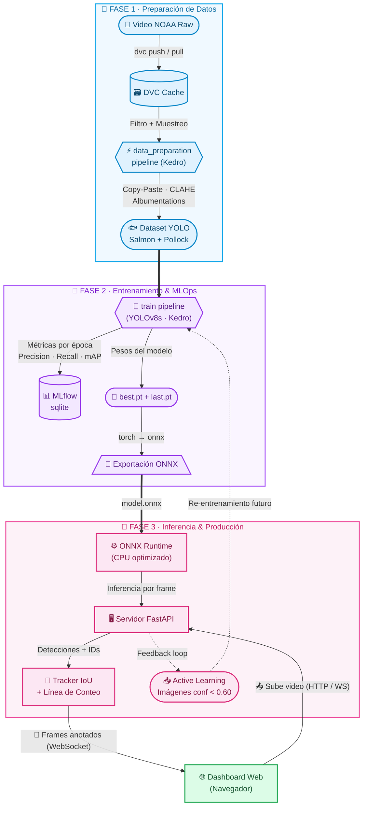
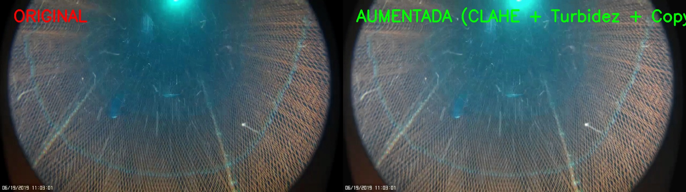
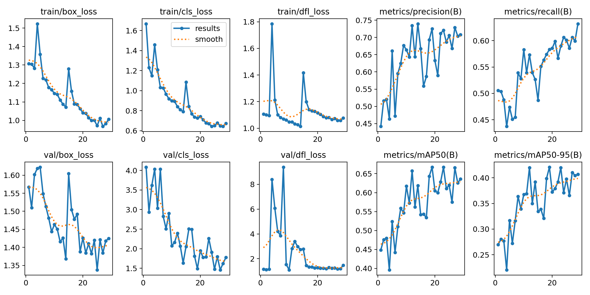
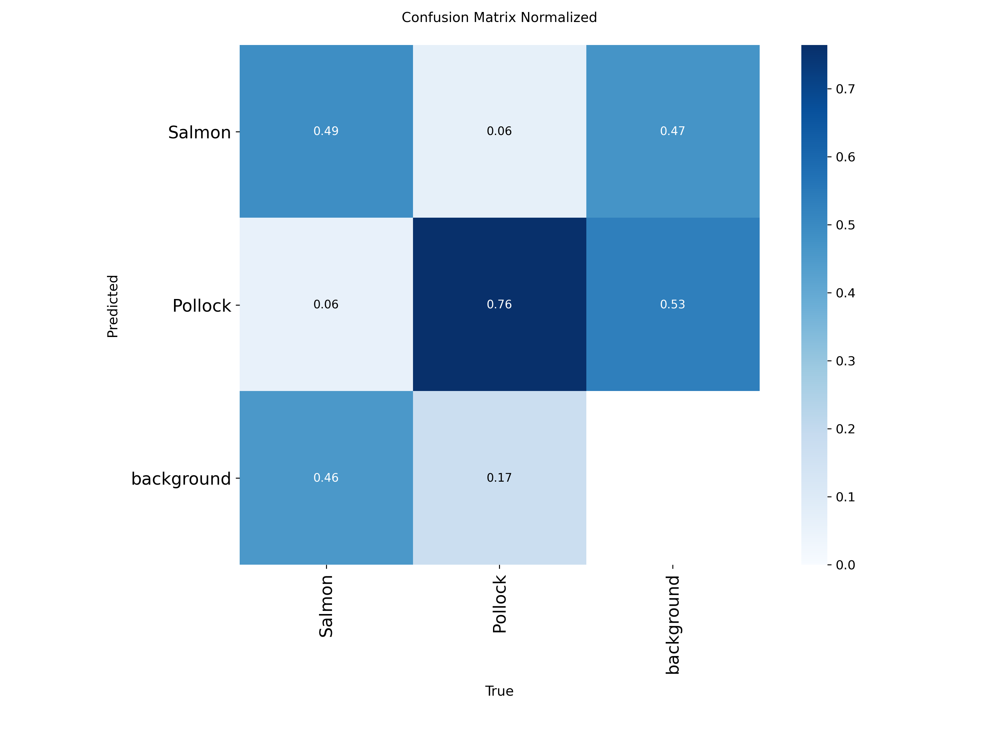
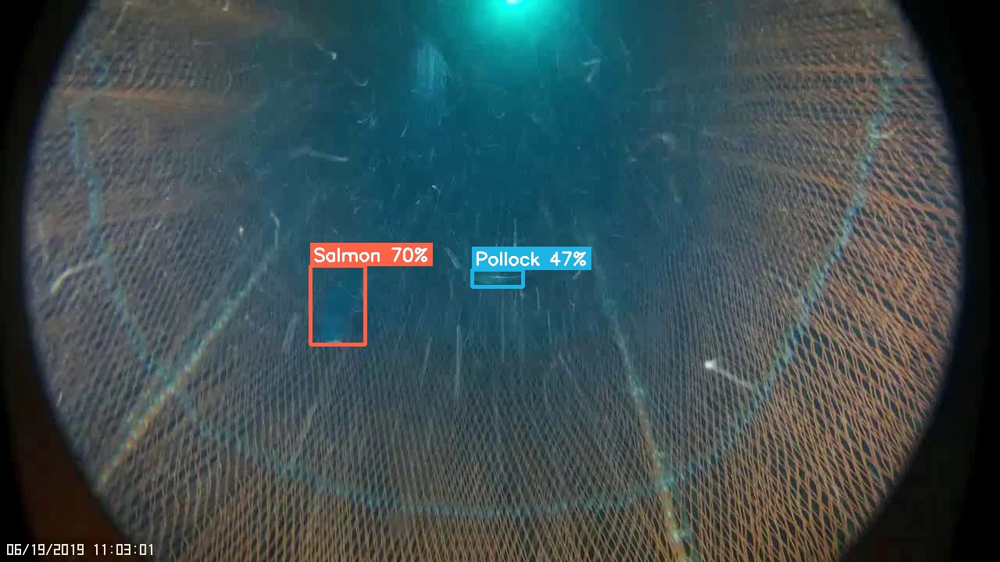
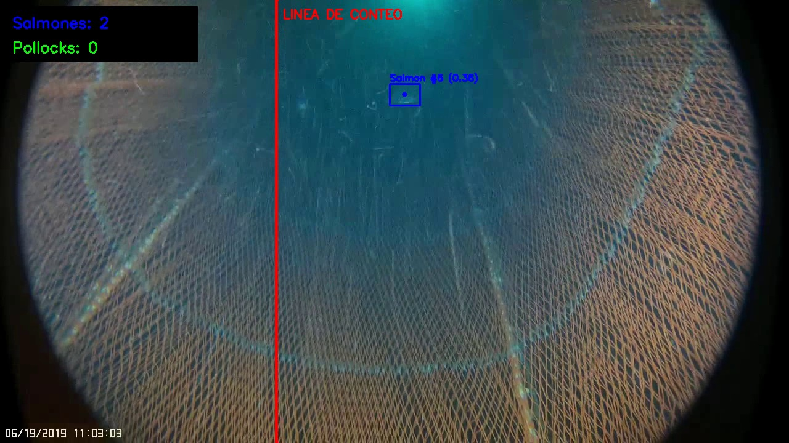
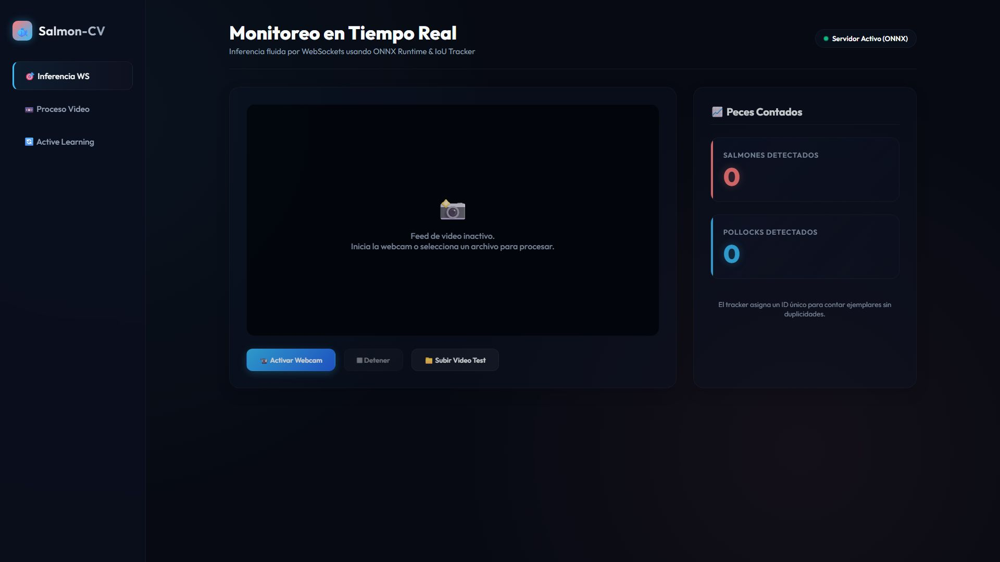
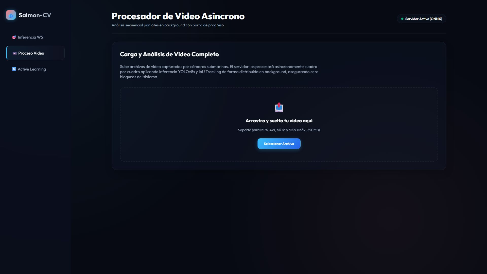
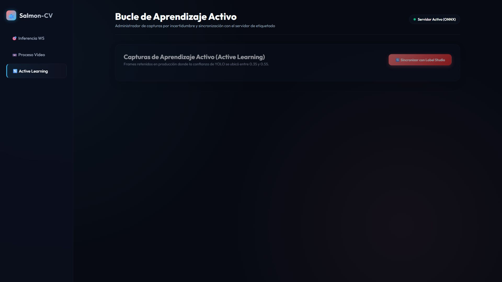

# 🐟 Salmon-CV: Detección y Rastreo Subacuático de Peces

[](https://www.python.org/)
[](https://kedro.org/)
[](https://mlflow.org/)
[](https://dvc.org/)
[](https://onnxruntime.ai/)
[](https://fastapi.tiangolo.com/)

> [!IMPORTANT]  
> **Aviso de Propósito Educativo:** Este proyecto ha sido desarrollado exclusivamente con fines de aprendizaje y exploración en el área de **Visión por Computador (Computer Vision)** y **MLOps**. 
>
> **Nota sobre Hardware:** Dado que el entrenamiento se realizó en un entorno local **sin GPU dedicada (únicamente CPU)**, los resultados de detección y precisión pueden no ser óptimos para casos de uso reales. Sin embargo, **el núcleo de este proyecto radica en su arquitectura de producción, sus flujos de trabajo automatizados (pipelines), su optimización para Edge AI (ONNX Runtime) y la estrategia integral para llevarlo a producción.**

---

## 📌 Descripción del Proyecto

**Salmon-CV** es una plataforma end-to-end de Visión por Computador para detectar, rastrear y contar especies de peces subacuáticos (específicamente **Salmón** y **Abadejo / Pollock**) a partir de transmisiones de video NOAA. 

El proyecto se divide en dos módulos independientes pero conectados:
1. **Pipeline de Entrenamiento (`training/`):** Estructurado con **Kedro**, registra experimentos de manera automática en una base de datos local de **MLflow** y versiona los datos con **DVC**.
2. **Microservicio de Inferencia y Dashboard (`serving/`):** Desarrollado en **FastAPI** y optimizado para CPU mediante **ONNX Runtime**, el cual cuenta con un **Dashboard Web interactivo** para subir videos, monitorizar derivas de datos (Data Drift) y visualizar conteos en tiempo real con un algoritmo de seguimiento (*Object Tracking*) basado en intersección sobre unión (IoU).

---

## 🏗️ Arquitectura y Flujo del Sistema

El proyecto está diseñado bajo principios modernos de MLOps de "Costo Cero" y desacoplamiento de componentes:



---

## 📸 Galería de Visualizaciones y Resultados Reales

### 1. Preparación de Datos y Aumentación Subacuática
Dado que el entorno marino presenta problemas de baja visibilidad, turbidez del agua y colorimetría verdosa/azulada, el pipeline aplica aumentaciones avanzadas usando **Albumentations** (incluyendo *CLAHE* para mejorar el contraste, desenfoque gaussiano para simular turbidez y técnicas de *Copy-Paste* para balancear la clase Salmon).

| Imagen Original (NOAA Frame) | Imagen Aumentada en Dataset (Entrenamiento) |
| :---: | :---: |
|  | *Contraste CLAHE, simulación de turbidez y pegado de máscaras de peces.* |

---

### 2. Resultados del Entrenamiento (Métricas Reales)
El modelo `yolov8s.pt` fue entrenado por **29 épocas** en CPU, deteniéndose tras alcanzar el mejor equilibrio en la **época 19** (`mAP50 = 0.667` / `mAP50-95 = 0.420`) gracias al mecanismo de parada temprana (*Early Stopping*).

```
Métricas de la mejor época (Época 19):
├── Precision: 0.72518
├── Recall:    0.58339
├── mAP50:     0.66750
└── mAP50-95:  0.42062
```



*A la izquierda se observa la convergencia constante de las pérdidas de caja y clase en entrenamiento. A la derecha, el pico de mAP y precisión en la época 19 antes de iniciar la divergencia de validación (overfitting).*

#### Matriz de Confusión de Validación
Visualización del rendimiento del detector clase por clase en el set de validación:



---

### 3. Detección Real de Peces (Inferencia ONNX)
Resultado real de inferencia ejecutada con el modelo ONNX sobre un frame de video NOAA. Se detectan ambas especies con sus cajas delimitadoras y porcentaje de confianza:



*El modelo identifica un **Salmon** (70% de confianza, caja roja) y un **Pollock** (47% de confianza, caja azul) en una escena subacuática con red de arrastre y baja visibilidad.*

---

### 4. Rastreo y Conteo en Tiempo Real (Inferencia en Video)
Inferencia real en un canal o red de arrastre NOAA, donde se asocian IDs únicos a cada pez individual para contarlos a medida que cruzan la línea roja divisoria:



*En el frame se muestra la detección de un ejemplar de Salmón (ID #6, confianza 0.36), la línea virtual de conteo roja y el panel de conteo acumulado (Salmones: 2, Pollocks: 0) en la esquina superior izquierda.*

---

### 5. Dashboard Web de Producción (Capturas Reales del Navegador)
El sistema se ejecuta localmente en `http://localhost:8000` y ofrece **3 secciones funcionales** a través de un dashboard interactivo dark-mode con glassmorphism:

#### 🎯 Tab 1 — Inferencia en Tiempo Real (WebSockets)
Conecta tu webcam o sube un video para obtener inferencia frame-a-frame con detecciones dibujadas en vivo y conteo acumulado de Salmones y Pollocks:



#### 📼 Tab 2 — Procesador de Video Asíncrono
Arrastra y suelta un archivo de video (MP4, AVI, MOV, MKV) para que el servidor lo procese en background cuadro por cuadro con barra de progreso:



#### 🔄 Tab 3 — Bucle de Aprendizaje Activo (Active Learning)
Visualiza los frames donde el modelo tuvo baja confianza (entre 0.35 y 0.55) y sincroniza con un servidor de etiquetado (Label Studio) para re-entrenar el modelo:



---

## 🛠️ Instalación y Configuración Local

Sigue estos pasos para instalar y ejecutar el proyecto completo en tu computadora local.

### Requisitos Previos
* **Python 3.10** o **Python 3.11** instalado.
* **Git** instalado.

---

### Paso 1: Clonar el Repositorio
Abre tu terminal y clona este repositorio:
```bash
git clone https://github.com/JuanAmpuero06/salmon-cv.git
cd salmon-cv
```

---

### Paso 2: Crear el Entorno Virtual y Activar
Crea un entorno virtual de Python para aislar las dependencias:
```bash
# Crear entorno virtual
python -m venv .venv

# Activar en Windows (PowerShell)
.venv\Scripts\Activate.ps1

# Activar en Linux o macOS
source .venv/bin/activate
```

---

### Paso 3: Instalar Dependencias de Entrenamiento y Servicio
Instala los paquetes necesarios para ambos componentes:
```bash
# Instalar dependencias de Kedro y MLflow (entrenamiento)
pip install -r training/requirements.txt

# Instalar dependencias de FastAPI y ONNX Runtime (producción/serving)
pip install -r serving/requirements.txt
```

---

## 🚀 Cómo Ejecutar el Proyecto

El flujo está diseñado para que puedas ejecutar el entrenamiento de forma local, visualizar las métricas y levantar el servidor web para inferencia.

### A. Ejecutar el Pipeline de Datos y Entrenamiento (Kedro)
Para procesar las imágenes NOAA (Copy-Paste + Albumentations) y entrenar el modelo YOLOv8:
```bash
cd training
kedro run
```
*Esto generará el dataset preparado, entrenará el detector y registrará los pesos resultantes en `training/data/06_models/yolo_runs/`.*

---

### B. Visualizar Experimentos en MLflow
Para abrir el servidor de seguimiento de MLflow y contrastar las curvas de pérdidas y parámetros registrados:
```bash
# Desde la carpeta /training
start_mlflow.bat

# Alternativamente (línea de comandos)
mlflow server --backend-store-uri sqlite:///mlflow.db
```
Una vez iniciado, abre en tu navegador: **[http://127.0.0.1:5000](http://127.0.0.1:5000)**.

---

### C. Iniciar el Servidor de Inferencia y Dashboard (FastAPI)
Para levantar el servidor de producción (que carga el modelo optimizado `model.onnx` usando ONNX Runtime):
```bash
# Regresa a la raíz del proyecto (salmon-cv) y ejecuta:
uvicorn serving.app:app --reload
```
Una vez que el servidor esté activo, abre en tu navegador: **[http://localhost:8000](http://localhost:8000)**. 
* ¡Desde aquí podrás subir tus videos de prueba (`serving/test_video_1.mp4`) para procesarlos y ver el tracker en tiempo real!

---

### D. Ejecución por Consola del Cliente de Simulación (Opcional)
Si deseas procesar un video directamente por línea de comandos utilizando el tracker y guardar el video de salida:
```bash
python serving/client_demo.py --video serving/test_video_1.mp4 --output serving/output_tracked.mp4
```

---

## 🔮 Flujo de Producción y MLOps (Fase Futura)

Aunque este proyecto se ejecuta de forma local y en CPU por motivos de aprendizaje, está diseñado con la infraestructura necesaria para escalar a producción:

1. **Active Learning (Aprendizaje Activo):** Cuando el modelo detecta peces con una confianza baja (ej. entre $0.30$ y $0.60$), el microservicio FastAPI guarda automáticamente los frames en `serving/data/active_learning/`. Estas imágenes se reincorporan automáticamente al pipeline de Kedro para futuros re-entrenamientos.
2. **Monitorización de Deriva (Data Drift):** El script `monitor_drift.py` utiliza pruebas estadísticas (como Kolmogorov-Smirnov) para evaluar si las nuevas imágenes de la cámara submarina tienen diferencias significativas en brillo o contraste (debido a cambios estacionales o algas), alertando cuando el modelo requiera calibración.
3. **Exportación ONNX / TensorRT:** La conversión a ONNX elimina la dependencia de frameworks de entrenamiento (PyTorch/Ultralytics) reduciendo el tamaño del contenedor Docker y la memoria RAM requerida en el nodo Edge.

---

## 👥 Contribuciones e Información del Autor

Este proyecto forma parte de mi portafolio de aprendizaje en Inteligencia Artificial y Visión por Computador. ¡Cualquier sugerencia para mejorar la precisión del modelo en CPU o refinar la mezcla de bordes del Copy-Paste es bienvenida!

* **Autor:** Juan Ampuero
* **GitHub:** [@JuanAmpuero06](https://github.com/JuanAmpuero06)
