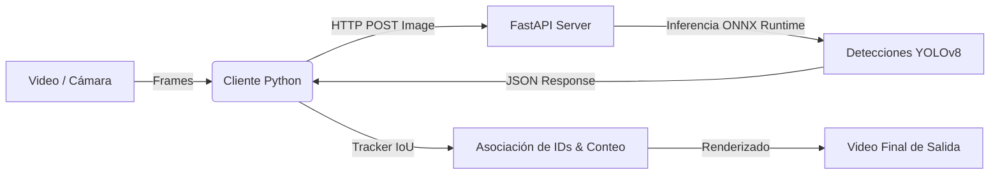

# 🐟 Microservicio de Inferencia de Peces (Serving) - Costo Cero

Este módulo contiene la implementación de producción para el servicio de inferencia en tiempo real, optimización y rastreo de peces (**Salmon** y **Pollock**) a partir de nuestro modelo YOLOv8 entrenado.

Este componente está diseñado bajo principios de ingeniería de producción:
1.  **Costo Cero:** No requiere servicios en la nube de pago, ni licencias comerciales de software.
2.  **Optimización Extrema para CPU (Edge AI):** El modelo se exportó a formato **ONNX** y corre mediante **ONNX Runtime**, lo que reduce drásticamente la latencia y elimina la necesidad de contar con una GPU dedicada o instalar la pesada biblioteca PyTorch/Ultralytics en el entorno de producción.
3.  **Desacoplamiento Completo:** El servidor web es completamente independiente del pipeline de entrenamiento (Kedro).
4.  **Rastreo y Conteo (Object Tracking):** Incluye un rastreador basado en IoU de alto rendimiento que asigna IDs únicos a cada pez, permitiendo contar cuántos individuos cruzan una línea de conteo virtual en video.

---

## 🏗️ Arquitectura del Sistema



*   **`app.py`:** Servidor web FastAPI. Carga el modelo `model.onnx`, realiza el preprocesamiento de la imagen (Letterbox, escala y normalización), ejecuta la sesión de ONNX Runtime, aplica Non-Maximum Suppression (NMS) con OpenCV y retorna las predicciones.
*   **`tracker.py`:** Algoritmo personalizado de rastreo IoU de alta velocidad con lógica de conteo por cruce de línea vertical.
*   **`client_demo.py`:** Cliente de simulación de streaming. Lee un video frame a frame, consume la API, alimenta al tracker y renderiza el resultado final en un nuevo archivo de video.

---

## 🚀 Guía de Inicio Rápido (3 Comandos)

Sigue estos 3 simples comandos para inicializar el servidor y procesar un video con tracking en tiempo real:

### 1. Instalar dependencias
Asegúrate de estar en el entorno virtual del proyecto e instala las dependencias de servicio:
```bash
pip install -r serving/requirements.txt
```

### 2. Iniciar el Servidor FastAPI
Inicia el microservicio local usando `uvicorn` (se ejecutará en `http://localhost:8000` por defecto):
```bash
uvicorn serving.app:app --reload
```

### 3. Ejecutar el Cliente de Simulación y Tracking
En otra terminal, corre el cliente pasando la ruta de un video de prueba (por ejemplo, los videos descargados en la carpeta `training/data/01_raw/` o cualquier video de prueba subacuático):
```bash
python serving/client_demo.py --video training/data/01_raw/video_prueba.mp4 --output serving/output_resultado.mp4
```

---

## 📊 Endpoints de la API

### `GET /health`
Verifica el estado de salud del servidor y valida si el modelo ONNX está cargado correctamente.

**Ejemplo de respuesta:**
```json
{
  "status": "healthy",
  "model": "model.onnx"
}
```

### `POST /detect`
Recibe un archivo de imagen en formato binario (multipart form-data) y devuelve la lista de peces detectados junto con su confianza y coordenadas normalizadas.

*   **Parámetros:** `file` (imagen)
*   **Ejemplo de respuesta:**
```json
{
  "predictions": [
    {
      "class_id": 0,
      "class_name": "Salmon",
      "confidence": 0.845,
      "box": [124, 210, 310, 405]
    },
    {
      "class_id": 1,
      "class_name": "Pollock",
      "confidence": 0.912,
      "box": [400, 50, 480, 180]
    }
  ],
  "inference_time_ms": 42.15
}
```

---

## 🛠️ Detalles Técnicos de Optimización

*   **Preprocesamiento Letterbox:** Implementado directamente en OpenCV para asegurar que las proporciones del pez no se distorsionen al escalar la imagen original al tamaño de entrada del modelo ($512 \times 512$).
*   **NMS en Inferencia:** El modelo ONNX genera miles de cajas candidatas. El postprocesamiento utiliza `cv2.dnn.NMSBoxes`, el cual está escrito en C++ nativo a través de OpenCV, garantizando velocidades de supresión de milisegundos.
*   **Rastreo IoU (Object Tracking):** Un tracker sofisticado de centroid/IoU diseñado a medida en Python que rastrea peces de forma separada por especie y detecta el cruce exacto sobre un umbral configurable del ancho del video (por defecto $50\%$).
